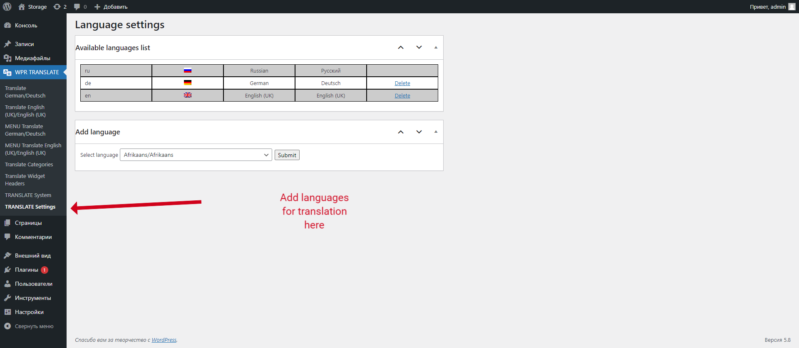
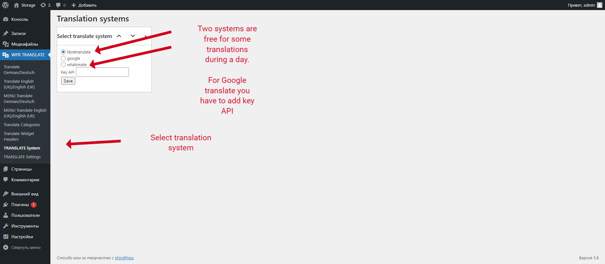
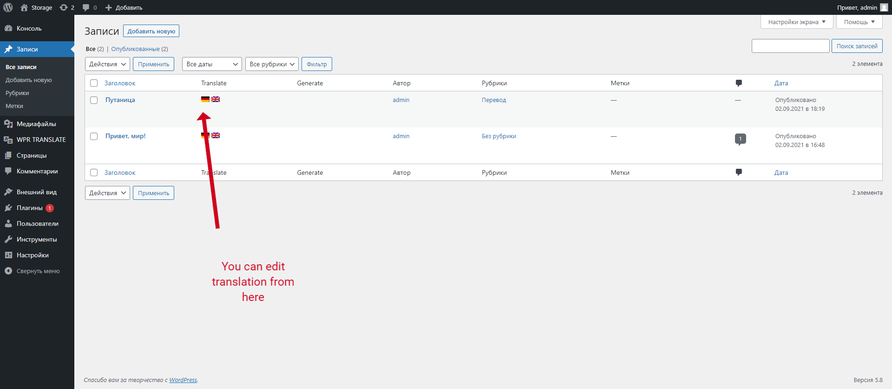
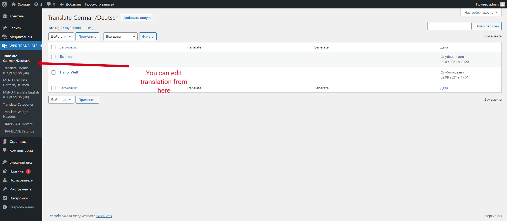
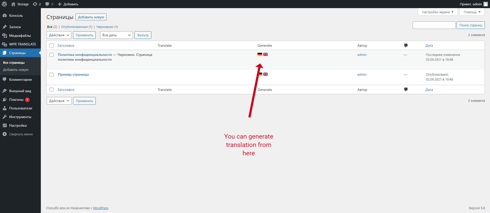

# alwpr_translate

Translation system for WP

== Description ==

This plugin is for translation for Wordpress. It has automatic translation function and functions of saving and editing translation.
For new posts if plugin does not detect a translation in DB, it connect to chosen translation service, get translation, and save it to DB.
Admin of WP can edit to the translations and correct them. 
For frontend part the plugin has widget with language selector

== Installation ==

1. Upload plugin folder to the `/wp-content/plugins/` directory
2. Activate the plugin through the 'Plugins' menu in WordPress
3. Select languages you want to add
4. Select translation service you want to use
5. Add WP translate widget to widget place
6. Enjoy

== Screenshots ==

1. Select languages you want to add

2. Select translation service you want to use

3. Edit translation

4. Edit translation

5. Edit translation
